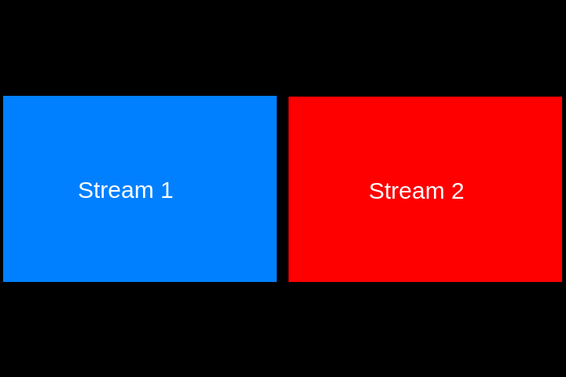
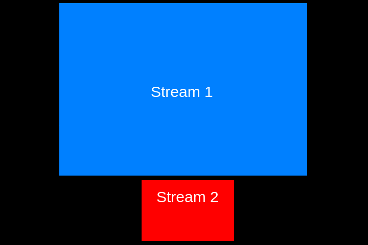

# Filter & MCU Plugin

Filter Plugin let you add filters on the ongoing streams by using REST API and this plugin contains MCU implementation. 
This plugin is deployed in the Ant Media Server Enterprise version. 

# MCU Usage

Please check this [blogpost](https://antmedia.io/mcu-conference/).

## How to change MCU layout?
MCU layout is determined by the `public static String createVideoFilter(int streamCount)` method in `FilterUtils.java`. 
This method takes the stream count as input and generates an ffmpeg filter text. This text defines the layout. You can find more about ffmpeg filters [here](https://ffmpeg.org/ffmpeg-filters.html).

To change the MCU layout, you should edit `createVideoFilter` method according to the layout you want to form. 

You should use `[in0]`, `[in1]` ... `[inN]`  and `[out0]` labels to define the inputs and the output in the filter text.

After you finalize your work on the code, you should build the plugin and replace the previous plugin with the new one as told below.

### Example Filter Text
The following is a generated filter text for 2 streams by the default `createVideoFilter` method.

```
[in0]scale=354:234:force_original_aspect_ratio=decrease,pad=360:240:3:3:color=black[s0];[in1]scale=354:234:force_original_aspect_ratio=decrease,pad=360:240:3:3:color=black[s1];[s0][s1]hstack=inputs=2,pad=720:480:(ow-iw)/2:(oh-ih)/2[out0]
```

This text forms the layout below.



You may create such a text for bigger frame for the first stream and smaller frame for the second stream which are vertically alligned.

```
[in0]scale=534:354:force_original_aspect_ratio=decrease,pad=720:360:93:3:color=black[s0];[in1]scale=174:114:force_original_aspect_ratio=decrease,pad=720:120:273:3:color=black[s1];[s0][s1]vstack=inputs=2,pad=720:480:0:0[out0]
```

This text forms the layout below.



# Filter Usage

To use filtering, you should add at least one adaptive setting. 
You can create a filter on a stream or multiple streams.
To create a filter you should use the POST method `/v2/filters/create`.
You should pass the filter configuration in JSON format. That JSON should contain
- **inputStreams:** list of the streams that will be used in the filter
- **outputStreams:** stream id of the ouput(filtered) stream
- **videoFilter:** video filter definition, define inputs as [in0], [in1] ... 
- **audioFilter:** audio filter definition, define inputs as [out0], [out1] ...
- **videoEnabled:** true if video will be filtered
- **audioenabled:** true

**Example:** You can apply a vertical flip filter to videao and copy filter to audio with the following REST method call:

```
curl -i -X POST -H "Accept: Application/json" -H "Content-Type: application/json" "http://localhost:5080/WebRTCAppEE/rest/v2/filters/create" -d '{"inputStreams":["stream1"],"outputStreams":["test"],"videoFilter":"[in0]vflip[out0]","audioFilter":"[in0]acopy[out0]","videoEnabled":"true","audioEnabled":"true"}'
```

Note that the stream ID should be `stream1` and the filtered stream ID will be `test`.

# Build
To build Filter Plugin you should first clone and build [ant-media-server-parent](https://github.com/ant-media/ant-media-server-parent) project.

You can build it with the following maven command:

`mvn clean install -Dmaven.javadoc.skip=true -Dmaven.test.skip=true -Dgpg.skip=true`

After building the parent project you can build filter project with the sam maven command:

`mvn clean install -Dmaven.javadoc.skip=true -Dmaven.test.skip=true -Dgpg.skip=true`

Then you will get the new `ant-media-filter-plugin.jar` file in the `target` folder and copy it into `/usr/local/antmedia/plugins` directory.


